Geog6300: Lab 6
================

## Regression

``` r
library(sf)
library(tidyverse)
library(tmap)
library(knitr)
library(lmtest)
library(car)
```

**Overview:** This lab focuses on regression techniques. You’ll be
analyzing the association of various physical and climatological
characteristics in Australia with observations of several animals
recorded on the citizen science app iNaturalist.

\###Data and research questions###

Let’s import the dataset.

``` r
lab6_data<-st_read("data/aus_climate_inat.gpkg")
```

    ## Reading layer `aus_climate_inat' from data source 
    ##   `C:\Users\iance\OneDrive - University of Georgia\Documents\geog4-6300-lab-6-ianearleywx\data\aus_climate_inat.gpkg' 
    ##   using driver `GPKG'
    ## Simple feature collection with 716 features and 22 fields
    ## Geometry type: POLYGON
    ## Dimension:     XY
    ## Bounding box:  xmin: 113.875 ymin: -43.38632 xmax: 153.375 ymax: -11.92074
    ## Geodetic CRS:  WGS 84 (CRS84)

The dataset for this lab is a 1 decimal degree hexagon grid that has
aggregate statistics for a number of variables:

- ndvi: NDVI/vegetation index values from Landsat data (via Google Earth
  Engine). These values range from -1 to 1, with higher values
  indicating more vegetation.
- maxtemp_00/20_med: Median maximum temperature (C) in 2000 or 2020
  (data from SILO/Queensland government)
- mintemp_00/20_med: Median minimum temperature (C) in 2020 or 2020
  (data from SILO/Queensland government)
- rain_00/20_sum: Total rainfall (mm) in 2000 or 2020 (data from
  SILO/Queensland government)
- pop_00/20: Total population in 2000 or 2020 (data from NASA’s Gridded
  Population of the World)
- water_00/20_pct: Percentage of land covered by water at some point
  during the year in 2000 or 2020
- elev_med: Median elevation (meters) (data from the Shuttle Radar
  Topography Mission/NASA)

There are also observation counts from iNaturalist for several
distinctively Australian animal species: the central bearded dragon, the
common emu, the red kangaroo, the agile wallaby, the laughing
kookaburra, the wombat, the koala, and the platypus.

Our primary research question is how the climatological/physical
variables in our dataset are predictive of the NDVI value. We will build
models for 2020 as well as the change from 2000 to 2020. The second is
referred to as a “first difference” model and can sometimes be more
useful for identifying causal mechanisms.

\###Part 1: Analysis of 2020 data###

We will start by looking at data for 2020.

**Question 1** *Create histograms for NDVI, max temp., min temp., rain,
and population, and water in 2020 as well as elevation. Based on these
graphs, assess the normality of these variables.*

``` r
Aus_data_2020<-lab6_data %>%
  select(maxtemp_20_med, mintemp_20_med, rain_20_sum, ndvi_20_med, water_20_pct, pop_20, elev_med)

hist(Aus_data_2020$maxtemp_20_med)
```

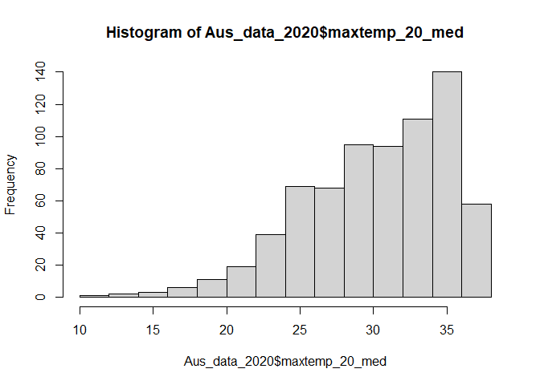<!-- -->

``` r
hist(Aus_data_2020$mintemp_20_med)
```

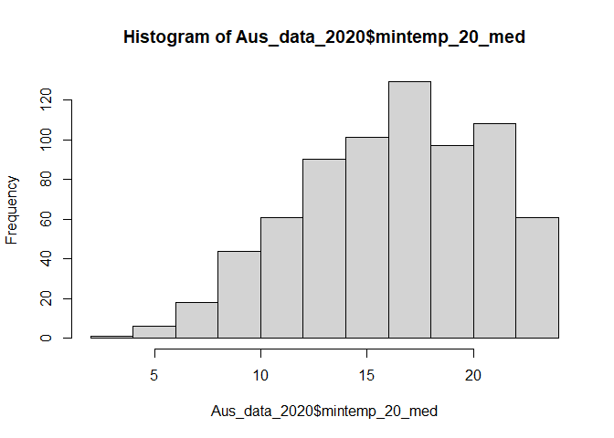<!-- -->

``` r
hist(Aus_data_2020$rain_20_sum)
```

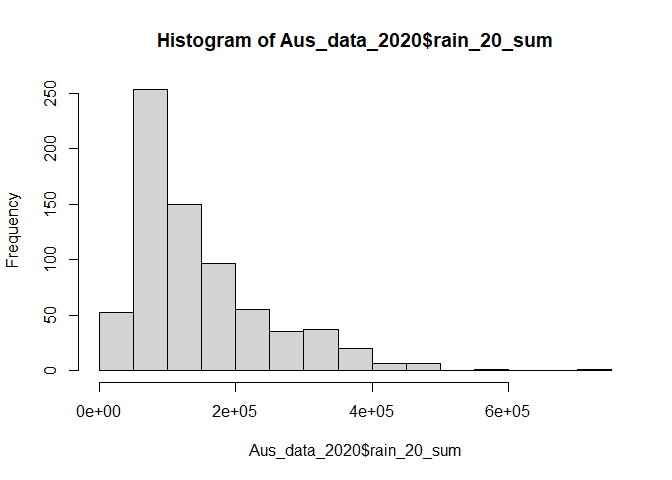<!-- -->

``` r
hist(Aus_data_2020$ndvi_20_med)
```

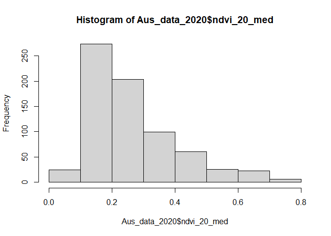<!-- -->

``` r
hist(Aus_data_2020$water_20_pct)
```

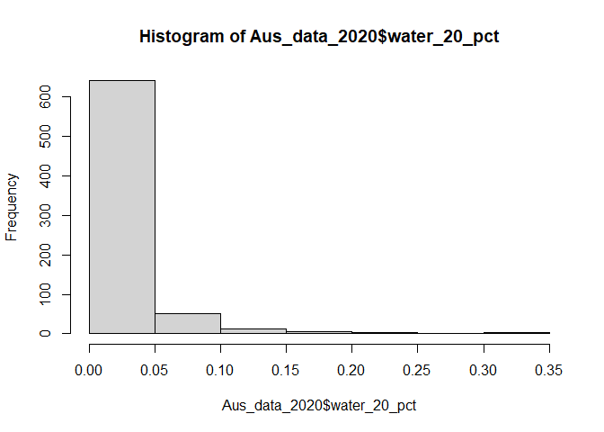<!-- -->

``` r
hist(Aus_data_2020$pop_20)
```

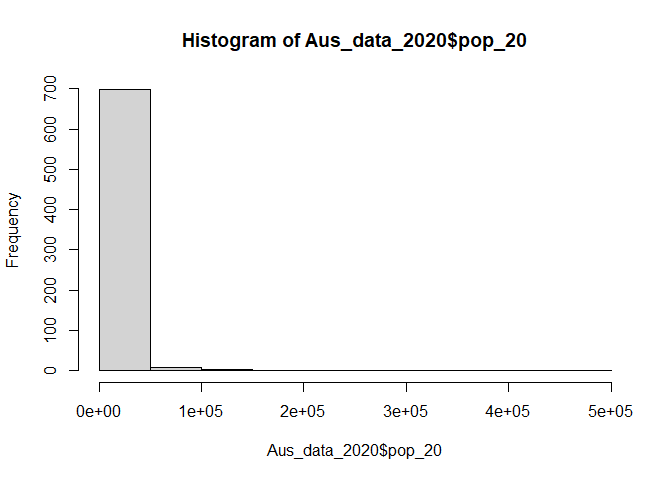<!-- -->

``` r
hist(Aus_data_2020$elev_med)
```

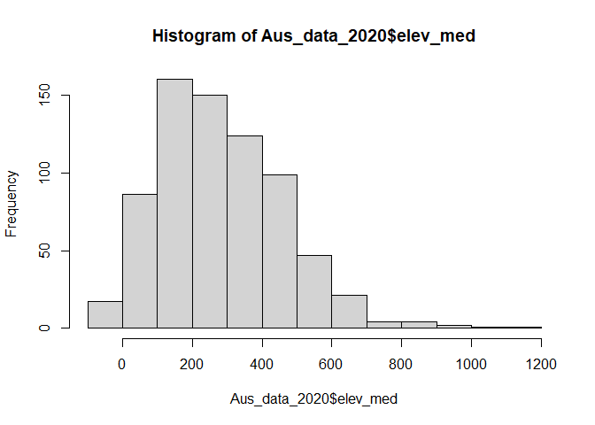<!-- -->

{All the variables tested was non-parametric, or distributed unevenly.
This is through that the histograms show skewness on all of the
variables, with maxtemp and mintemp variables being skewed to the left
while rain_20_sum, ndvi_20_med, water_20_pct, pop_20, and elev_med
variables are being skewed to the right. Thsi would mean that the
p-value would be less than 0.05 and would reject the null hypothesis.}

**Question 2** *Use tmap to map these same variables using Jenks natural
breaks as the classification method. For an extra challenge, use
`tmap_arrange` to plot all maps in a single figure.*

``` r
tmap_mode("plot")
```

    ## tmap mode set to plotting

``` r
tm_shape(Aus_data_2020) + 
  tm_polygons("maxtemp_20_med", style = "jenks") 
```

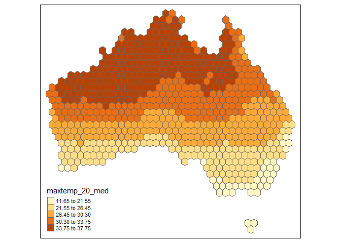<!-- -->

``` r
tm_shape(Aus_data_2020) +
  tm_polygons("mintemp_20_med", style = "jenks") 
```

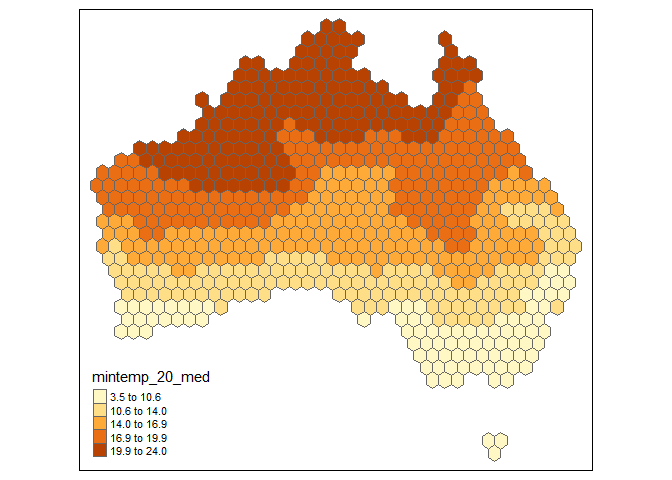<!-- -->

``` r
tm_shape(Aus_data_2020) + 
  tm_polygons("rain_20_sum", style = "jenks") 
```

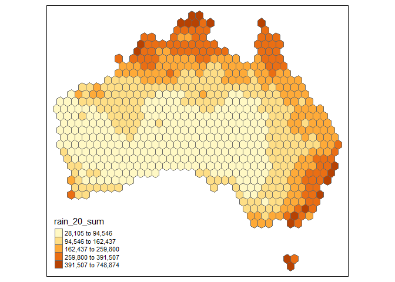<!-- -->

``` r
tm_shape(Aus_data_2020) + 
  tm_polygons("ndvi_20_med", style = "jenks")
```

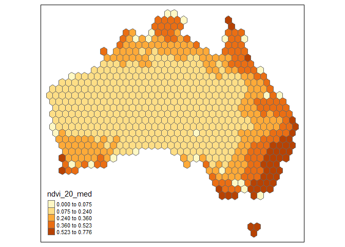<!-- -->

``` r
tm_shape(Aus_data_2020) + 
  tm_polygons("water_20_pct", style = "jenks")
```

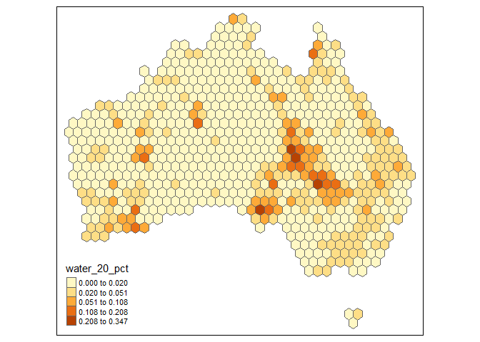<!-- -->

``` r
tm_shape(Aus_data_2020) + 
  tm_polygons("pop_20", style = "jenks")
```

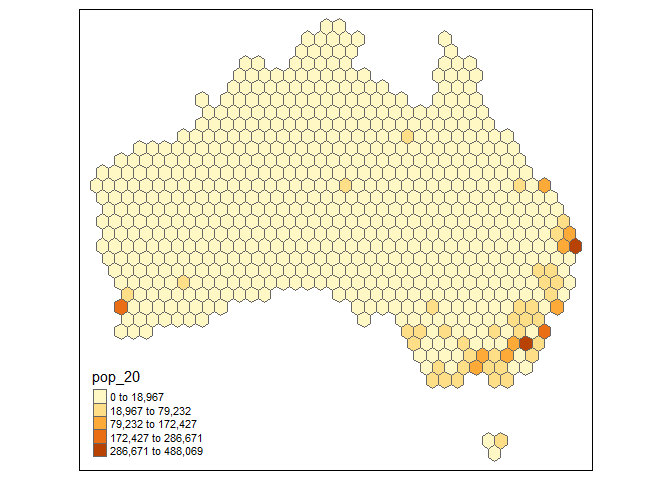<!-- -->

``` r
tm_shape(Aus_data_2020) + 
  tm_polygons("elev_med", style = "jenks")
```

    ## Variable(s) "elev_med" contains positive and negative values, so midpoint is set to 0. Set midpoint = NA to show the full spectrum of the color palette.

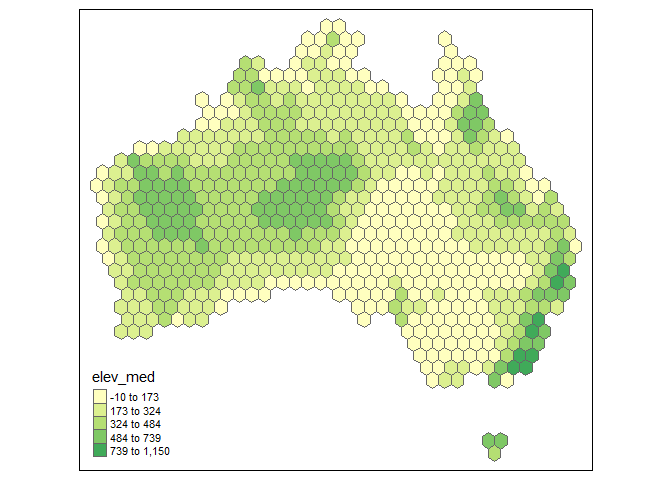<!-- -->

**Question 3** *Based on the maps from question 2, summarise major
patterns you see in the spatial distribution of these data from any of
your variables of interest. How do they appear to be associated with the
NDVI variable?*

{In the plots, there are two major patterns that I see. One being that
when NDVI and rain_20_sum, they are almost in the exact same place,
which is along most of the coastlines in Australia. What this means is
that the NDVI and rain_20_sum variables are positively correlated with
each other. The other major pattern that when looking at water_20_pct
variable, most of the points are located more inland than on the
coastlines. When it’s compared to the NDVI variable, the lowest values
are located where the highest percentage of water is. What this means
that the NDVI and water_20_pct variables are negatively correlated with
each other.}

**Question 4** *Create univariate models for each of the variables
listed in question 1, with NDVI in 2020 as the dependent variable. Print
a summary of each model. Write a summary of those results that indicates
the direction, magnitude, and significance for each model coefficient.*

``` r
model1<-lm(ndvi_20_med~maxtemp_20_med, data = Aus_data_2020)
summary(model1)
```

    ## 
    ## Call:
    ## lm(formula = ndvi_20_med ~ maxtemp_20_med, data = Aus_data_2020)
    ## 
    ## Residuals:
    ##      Min       1Q   Median       3Q      Max 
    ## -0.41874 -0.07657 -0.01927  0.06833  0.36382 
    ## 
    ## Coefficients:
    ##                  Estimate Std. Error t value Pr(>|t|)    
    ## (Intercept)     0.6612389  0.0294372   22.46   <2e-16 ***
    ## maxtemp_20_med -0.0130902  0.0009601  -13.63   <2e-16 ***
    ## ---
    ## Signif. codes:  0 '***' 0.001 '**' 0.01 '*' 0.05 '.' 0.1 ' ' 1
    ## 
    ## Residual standard error: 0.1251 on 714 degrees of freedom
    ## Multiple R-squared:  0.2066, Adjusted R-squared:  0.2055 
    ## F-statistic: 185.9 on 1 and 714 DF,  p-value: < 2.2e-16

``` r
model2<-lm(ndvi_20_med~mintemp_20_med, data = Aus_data_2020)
summary(model2)
```

    ## 
    ## Call:
    ## lm(formula = ndvi_20_med ~ mintemp_20_med, data = Aus_data_2020)
    ## 
    ## Residuals:
    ##      Min       1Q   Median       3Q      Max 
    ## -0.36375 -0.08418 -0.03047  0.06972  0.40383 
    ## 
    ## Coefficients:
    ##                 Estimate Std. Error t value Pr(>|t|)    
    ## (Intercept)     0.464461   0.018997   24.45   <2e-16 ***
    ## mintemp_20_med -0.012282   0.001131  -10.86   <2e-16 ***
    ## ---
    ## Signif. codes:  0 '***' 0.001 '**' 0.01 '*' 0.05 '.' 0.1 ' ' 1
    ## 
    ## Residual standard error: 0.1301 on 714 degrees of freedom
    ## Multiple R-squared:  0.1418, Adjusted R-squared:  0.1406 
    ## F-statistic:   118 on 1 and 714 DF,  p-value: < 2.2e-16

``` r
model3<-lm(ndvi_20_med~rain_20_sum, data = Aus_data_2020)
summary(model3)
```

    ## 
    ## Call:
    ## lm(formula = ndvi_20_med ~ rain_20_sum, data = Aus_data_2020)
    ## 
    ## Residuals:
    ##      Min       1Q   Median       3Q      Max 
    ## -0.56681 -0.04753 -0.01210  0.04599  0.30930 
    ## 
    ## Coefficients:
    ##              Estimate Std. Error t value Pr(>|t|)    
    ## (Intercept) 1.303e-01  7.060e-03   18.45   <2e-16 ***
    ## rain_20_sum 9.124e-07  3.953e-08   23.08   <2e-16 ***
    ## ---
    ## Signif. codes:  0 '***' 0.001 '**' 0.01 '*' 0.05 '.' 0.1 ' ' 1
    ## 
    ## Residual standard error: 0.1063 on 714 degrees of freedom
    ## Multiple R-squared:  0.4273, Adjusted R-squared:  0.4265 
    ## F-statistic: 532.6 on 1 and 714 DF,  p-value: < 2.2e-16

``` r
model4<-lm(ndvi_20_med~water_20_pct, data = Aus_data_2020)
summary(model4)
```

    ## 
    ## Call:
    ## lm(formula = ndvi_20_med ~ water_20_pct, data = Aus_data_2020)
    ## 
    ## Residuals:
    ##      Min       1Q   Median       3Q      Max 
    ## -0.26898 -0.08838 -0.04838  0.06871  0.50911 
    ## 
    ## Coefficients:
    ##               Estimate Std. Error t value Pr(>|t|)    
    ## (Intercept)   0.268988   0.006287  42.781   <2e-16 ***
    ## water_20_pct -0.178263   0.154480  -1.154    0.249    
    ## ---
    ## Signif. codes:  0 '***' 0.001 '**' 0.01 '*' 0.05 '.' 0.1 ' ' 1
    ## 
    ## Residual standard error: 0.1403 on 714 degrees of freedom
    ## Multiple R-squared:  0.001862,   Adjusted R-squared:  0.0004636 
    ## F-statistic: 1.332 on 1 and 714 DF,  p-value: 0.2489

``` r
model5<-lm(ndvi_20_med~pop_20, data = Aus_data_2020)
summary(model5)
```

    ## 
    ## Call:
    ## lm(formula = ndvi_20_med ~ pop_20, data = Aus_data_2020)
    ## 
    ## Residuals:
    ##      Min       1Q   Median       3Q      Max 
    ## -0.47003 -0.07883 -0.03949  0.06384  0.48974 
    ## 
    ## Coefficients:
    ##              Estimate Std. Error t value Pr(>|t|)    
    ## (Intercept) 2.552e-01  5.013e-03  50.902   <2e-16 ***
    ## pop_20      1.500e-06  1.500e-07   9.998   <2e-16 ***
    ## ---
    ## Signif. codes:  0 '***' 0.001 '**' 0.01 '*' 0.05 '.' 0.1 ' ' 1
    ## 
    ## Residual standard error: 0.1316 on 714 degrees of freedom
    ## Multiple R-squared:  0.1228, Adjusted R-squared:  0.1216 
    ## F-statistic: 99.97 on 1 and 714 DF,  p-value: < 2.2e-16

``` r
model6<-lm(ndvi_20_med~elev_med, data = Aus_data_2020)
summary(model6)
```

    ## 
    ## Call:
    ## lm(formula = ndvi_20_med ~ elev_med, data = Aus_data_2020)
    ## 
    ## Residuals:
    ##      Min       1Q   Median       3Q      Max 
    ## -0.27082 -0.09585 -0.04270  0.07954  0.44272 
    ## 
    ## Coefficients:
    ##              Estimate Std. Error t value Pr(>|t|)    
    ## (Intercept) 2.138e-01  9.741e-03  21.952  < 2e-16 ***
    ## elev_med    1.787e-04  2.895e-05   6.171 1.14e-09 ***
    ## ---
    ## Signif. codes:  0 '***' 0.001 '**' 0.01 '*' 0.05 '.' 0.1 ' ' 1
    ## 
    ## Residual standard error: 0.1369 on 714 degrees of freedom
    ## Multiple R-squared:  0.05064,    Adjusted R-squared:  0.04931 
    ## F-statistic: 38.08 on 1 and 714 DF,  p-value: 1.136e-09

{When comparing the NDVI and maxtemp_20_med variable, the direction is
negative, which means that as maxtemp_20_med increases, NDVI decreases.
The magnitude is as maxtemp_20_med changes by one unit, NDVI changes by
-0.013. The significance is the p-value is 2e-16, which means its
statistically significant. When comparing the NDVI and mintemp_20_med
variable, the direction is negative, which means that as mintemp_20_med
increases, NDVI decreases. The magnitude is as mintemp_20_med changes by
one unit, NDVI changes by -0.012. The significance is the p-value is
2e-16, which means its statistically significant. When comparing the
NDVI and rain_20_sum variable, the direction is positive, which means
that as rain_20_sum increases, NDVI also increases. The magnitude is as
rain_20_sum changes by one unit, NDVI changes by 9.124e-7. The
significance is the p-value is 2e-16, which means its statistically
significant. When comparing the NDVI and water_20_pct variable, the
direction is negative, which means that as water_20_pct increases, NDVI
decreases. The magnitude is as water_20_pct changes by one unit, NDVI
changes by -0.1782. The significance is the p-value is 0.249, which
means it is not statistically significant. When comparing the NDVI and
pop_20 variable, the direction is positive, which means that as pop_20
increases, NDVI also increases. The magnitude is as pop_20 changes by
one unit, NDVI changes by 1.500e-6. The significance is the p-value is
2e-16, which means its statistically significant. When comparing the
NDVI and elev_med variable, the direction is positive, which means that
as elev_med increases, NDVI also increases. The magnitude is as elev_med
changes by one unit, NDVI changes by 1.787e-4. The significance is the
p-value is 1.14e-9, which means its statistically significant.}

**Question 5** *Create a multivariate regression model with the
variables of interest, choosing EITHER max or min temperature (but not
both) You may also choose to leave out any variables that were
insignificant in Q4. Use the univariate models as your guide. Call the
results.*

``` r
model_multi<-lm(ndvi_20_med~maxtemp_20_med+rain_20_sum+pop_20+elev_med, data = Aus_data_2020)
summary(model_multi)
```

    ## 
    ## Call:
    ## lm(formula = ndvi_20_med ~ maxtemp_20_med + rain_20_sum + pop_20 + 
    ##     elev_med, data = Aus_data_2020)
    ## 
    ## Residuals:
    ##      Min       1Q   Median       3Q      Max 
    ## -0.50217 -0.02838  0.00409  0.03919  0.20570 
    ## 
    ## Coefficients:
    ##                  Estimate Std. Error t value Pr(>|t|)    
    ## (Intercept)     4.571e-01  2.194e-02  20.828  < 2e-16 ***
    ## maxtemp_20_med -1.170e-02  6.796e-04 -17.220  < 2e-16 ***
    ## rain_20_sum     8.469e-07  3.263e-08  25.953  < 2e-16 ***
    ## pop_20          2.862e-07  1.044e-07   2.741  0.00627 ** 
    ## elev_med        1.233e-04  1.796e-05   6.864 1.46e-11 ***
    ## ---
    ## Signif. codes:  0 '***' 0.001 '**' 0.01 '*' 0.05 '.' 0.1 ' ' 1
    ## 
    ## Residual standard error: 0.0845 on 711 degrees of freedom
    ## Multiple R-squared:  0.6397, Adjusted R-squared:  0.6376 
    ## F-statistic: 315.5 on 4 and 711 DF,  p-value: < 2.2e-16

**Question 6** *Summarize the results of the multivariate model. What
are the direction, magnitude, and significance of each coefficient? How
did it change from the univariate models you created in Q4 (if at all)?
What do the R2 and F-statistic values tell you about overall model fit?*

{When comparing the NDVI and maxtemp_20_med variable, the direction is
negative, which means that as maxtemp_20_med increases, NDVI decreases.
The magnitude is as maxtemp_20_med changes by one unit, NDVI changes by
-1.170e-2. The significance is the p-value is 2e-16, which means its
statistically significant.When comparing the NDVI and rain_20_sum
variable, the direction is positive, which means that as rain_20_sum
increases, NDVI also increases. The magnitude is as rain_20_sum changes
by one unit, NDVI changes by 8.469e-7. The significance is the p-value
is 2e-16, which means its statistically significant. When comparing the
NDVI and pop_20 variable, the direction is positive, which means that as
pop_20 increases, NDVI also increases. The magnitude is as pop_20
changes by one unit, NDVI changes by 2.862e-7. The significance is the
p-value is 0.00627, which means its statistically significant. When
comparing the NDVI and elev_med variable, the direction is positive,
which means that as elev_med increases, NDVI also increases. The
magnitude is as elev_med changes by one unit, NDVI changes by 1.233e-4.
The significance is the p-value is 1.14e-9, which means its
statistically significant. When comparing the univariate and
multivariate models, there wasn’t much of a difference between the two
models except for a change in the estimate numbers and the pop_20
variables p-value changed. The R2 value was 0.6376 and the F-statistic
315.5. What this means is that for F-statistic, a high value means that
the regression model is effetcive in explaining the variation within the
dependent variable while for R2, the vlaue of 0.6376 means that the
independent variable is explaining most of the variations in the
dependent variable but could be a bit better.}

**Question 7** *Use a histogram and a map to assess the normality of
residuals and any spatial autocorrelation. Summarise any notable
patterns that you see.*

``` r
Aus_data_2020$residuals<-residuals(model_multi)

ggplot(Aus_data_2020, aes(x = residuals)) +    
  geom_histogram(fill = "blue", color = "black")
```

    ## `stat_bin()` using `bins = 30`. Pick better value with `binwidth`.

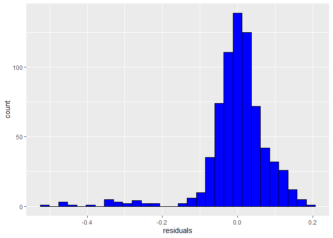<!-- -->

``` r
shapiro.test(Aus_data_2020$residuals)
```

    ## 
    ##  Shapiro-Wilk normality test
    ## 
    ## data:  Aus_data_2020$residuals
    ## W = 0.81946, p-value < 2.2e-16

``` r
tm_shape(Aus_data_2020) + 
  tm_fill("residuals", style = "quantile", palette = "RdBu") + 
  tm_borders()
```

    ## Variable(s) "residuals" contains positive and negative values, so midpoint is set to 0. Set midpoint = NA to show the full spectrum of the color palette.

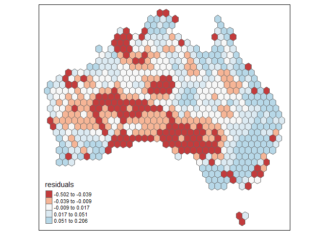<!-- -->

{One noticable pattern is that when looking at the histogram, the
residual data is distributed in a non-normal manner. This is through
that the data is left-skewed on the histogram. Another noticable pattern
is that there is some spatial autocorrelation throuhg clustering of high
residual values in south central and west central Australia.}

**Question 8** *Assess any issues with multicollinearity or
heteroskedastity in this model using the techniques shown in class. Run
the appropriate tests and explain what their results show you.*

``` r
bptest(model_multi) # Heteroskedastity
```

    ## 
    ##  studentized Breusch-Pagan test
    ## 
    ## data:  model_multi
    ## BP = 122.21, df = 4, p-value < 2.2e-16

``` r
vif(model_multi) # Multicollinearity
```

    ## maxtemp_20_med    rain_20_sum         pop_20       elev_med 
    ##       1.098705       1.078449       1.173863       1.009305

{After doing the heteroskadastity test, the BP value was 122.41 and the
p-value was 2e-16. What that tells us is that model is heteroskadastic
in the sense that the values are making the p-value be samller to what
they actually are. After doing the multicollinearity test, the values
for the 4 variables in the ultivariate regression model were between 1.0
and 1.2. This means the there is very little multicollinearity found in
the model.}

**Question 9** *How would you summarise the results of this model in a
sentence or two? In addition, looking at the full model and your
diagnostics, do you feel this is a model that provides meaningful
results? Explain your answer.*

{I would summarise the results in that NDVI is influenced by
maxtemp_20_pct, rain_20_sum, pop_20, and elev_med variables. I believe
that the model provides meaningful results. This si through that while
there is heteroskadastity, it doesn’t overshadow the whole dataset set
and still provides good results. It also amtches up based off of common
sense and logic, like vegetation growth or coverage is affected by
rainfall and so on. }

**Disclosure of assistance:** *Besides class materials, what other
sources of assistance did you use while completing this lab? These can
include input from classmates, relevant material identified through web
searches (e.g., Stack Overflow), or assistance from ChatGPT or other AI
tools. How did these sources support your own learning in completing
this lab?*

{I used classmates help to make sur eI was on the right track with my
code and was getting mostly the same results as they were. I also used
Stack Overflow and ChatGPT to help diagnose and repair error codes.
ChatGPT also helped me learn more about my error codes and helped me
learn how to prevent them in the future.}

**Lab reflection:** *How do you feel about the work you did on this lab?
Was it easy, moderate, or hard? What were the biggest things you learned
by completing it?*

{I believe that this was overall my second best lab that I have
completed. it was easier than others and after doing these labs for the
past few months, I feel like my confidence level in coding in Rstudio is
a lot better than when I started. This lab was pretty easy in the sense
that I had very few error when writing my code and the it wasn’t too
hard to actually write the code. The biggest thing that I learned was
how to conduct univariate and multivariate regression models and how to
intrepret the results from each test.}

**Challenge question**

\#Option 1 Create a first difference model. To do that, subtract the
values in 2000 from the values in 2020 for each variable for which that
is appropriate. Then create a new model similar to the one you created
in question 5, but using these new variables showing the *change in
values* over time. Call the results of the model, and interpret the
results in the same ways you did above. Also chart and map the residuals
to assess model error. Finally, write a short section that summarises
what, if anything, this model tells you.

\#Option 2 The animal data included in this dataset is an example of
count data, and usually we would use a Poisson or similar model for that
purpose. Let’s try it with regular OLS regression though. Create two
regression models to assess how the counts of two different animals
(say, koalas and emus) are associated with at least three of the
environmental/climatological variables given above. Be sure to use the
same independent variables in each model. Interpret the results of each
model and then explain the importance of any differences in the model
coefficients between them, focusing on direction, magnitude, and
significance.
